# Mapache free theme for [Ghost](https://github.com/tryghost/ghost/)

[](https://github.com/TryGhost/Ghost)
[](https://www.paypal.me/godofredoninja)

> Minimalist and Elegant theme.

Hi. I created this theme for ghost especially for you.
It is available for free so you can use on your site. If you have any suggestions to improve the theme,  you can send me a tweet [@GodoFredoNinja](https://goo.gl/y3aivK)

## If you have a :heart: heart and value my work. :pray: Please, help me with a small donation [Here](https://www.paypal.com/cgi-bin/webscr?cmd=_s-xclick&hosted_button_id=4H53Q4RTPSFQW&source=url) or [PayPal](https://www.paypal.me/godofredoninja). It'll help motivate me to update the theme with many improvements

[](https://www.paypal.me/godofredoninja)


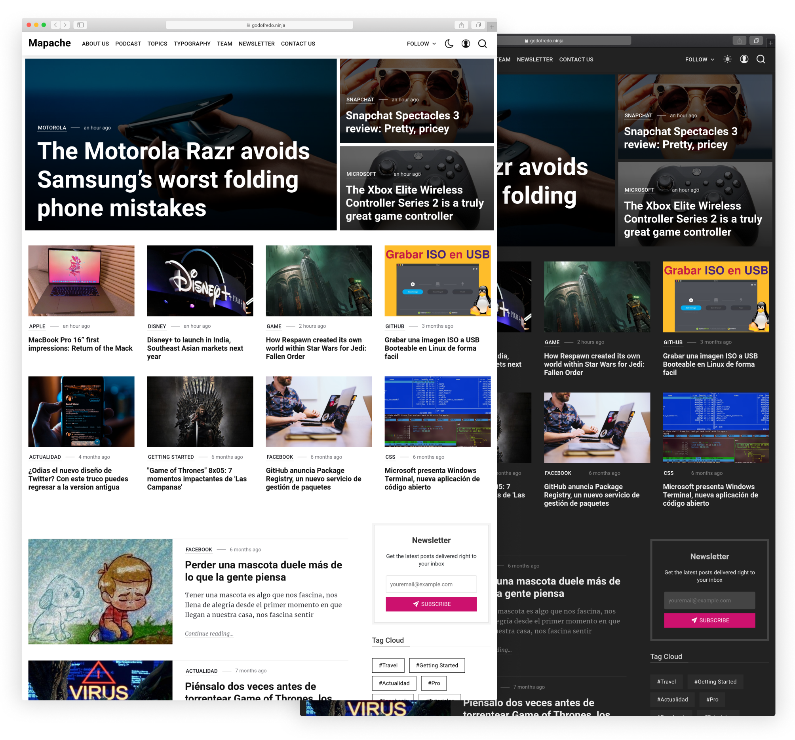

## Featured

- Support for different [languages](http://themes.ghost.org/docs/i18n#section-how-to-add-any-language) (en - es - de - ko - fr)
- Light Mode / Dark Mode
- 404 error page
- Pagination Infinite Scroll
- Instagram Feed in footer of Post
- Optional menu in the footer
- [AMP](https://github.com/godofredoninja/Hodor-AMP-Template-for-Ghost) Template (Accelerated Mobile Pages)
- Social Media
- Members / Subscription
- Very fast search engine
- Related Articles (6 articles)
- Different templates for the Home Page
- Different templates for publishing posts
- Page for (About Us - Podcast - Tag - Authors - Newsletter)
- 5 lates articles in the sidebar (post)
- Tag Cloud in the sidebar
- Previous and next articles buttons
- Support for comments (Disqus)
- Support for counter comments (Disqus)
- Buttons to share the article (Facebook - Twitter - Reddit - Linkedin - Pinterest)
- Beautiful gallery viewer
- Sticky content in the sidebar
- YouTube, Vimeo, kickstarter, dailymotion => Responsive
- Lazy image loading for better performance only in backgrounds
- Code syntax [Prismjs](http://prismjs.com/index.html#languages-list) Supported all syntax.

## Table of Contents

- [Web Browser Support for Mapache](#web-browser-support-for-mapache)
- [Ghost Settings](#ghost-settings)
- [Mapache Settings](#mapache-settings)
  - [1. Social Media](#1-social-media)
  - [2. Footer Menu](#2-footer-menu)
  - [3. Instagram](#3-instagram)
  - [4. Comments](#4-comments)
  - [5. Search](#5-search)
- [Home](#home-page)
  - [Tech](#home-page)
  - [Personal](#home-page)
  - [Blog](#home-page)
  - [Travel](#home-page)
  - [Travel with Featured Article](#home-page)
  - [Fashion Concept](#home-page)
- [Post](#post-format)
  - [Default Post](##post-format)
  - [Post Full Header](##post-format)
  - [Post Image](##post-format)
  - [Post Image Single](##post-format)
  - [Post Video](##post-format)
  - [Post Single](##post-format)
- [Page](#page)
  - [About Us](#about-us-page)
  - [Contact](#contact-page)
  - [Newsletter](#newsletter-page)
- [Archive](#authors-page)
  - [Authors](#authors-page)
  - [Tags](#tags-page)
  - [Podcast](#podcast-page)
- [Category](#category)
  - [Default Category](#category---defautl)
  - [Category with header](#category-with-header)
- [Members / Subscription](#members--subscription)
- [AMP](#amp)
- [Theme Translation](#theme-translation)
- [Change Theme Color](#change-theme-color)
- [PrismJS code syntax](#prismjs-code-syntax)

## Web Browser Support for mapache

mapache supports the following web [browsers](https://caniuse.com/#search=CSS%20Variables)

## Ghost Settings

Enable the following checkbox on the Labs page in the Ghost admin panel.

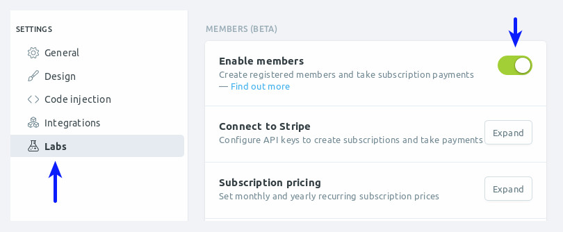

## Mapache Settings

> You don't have to add all the Mapache configurations. only the ones you need

### 1. Social Media

> Facebook and Twitter is not necessary because I use them from the ghost settings

Add the Social Links only for the services you want to appear in the header section of your website. Pay attention as enabling too many services will cause menu problems.

:arrow_right: `Dashboard -> Code injection -> Site Footer`

```html
<script>
var followSocialMedia = {
  'youtube': ['YOUR_URL','YOUR_TITLE'],
  'instagram': ['YOUR_URL','YOUR_TITLE'],
  'github': ['YOUR_URL','YOUR_TITLE'],
  'pinterest': ['YOUR_URL','YOUR_TITLE'],
  'linkedin': ['YOUR_URL','YOUR_TITLE'],
  'rss': ['YOUR_URL','YOUR_TITLE'],

  /*
  'snapchat': ['YOUR_URL','YOUR_TITLE'],
  'dribbble': ['YOUR_URL','YOUR_TITLE'],
  'spotify': ['YOUR_URL','YOUR_TITLE'],
  'codepen': ['YOUR_URL','YOUR_TITLE'],
  'behance': ['YOUR_URL','YOUR_TITLE'],
  'flickr': ['YOUR_URL','YOUR_TITLE'],
  'telegram': ['YOUR_URL','YOUR_TITLE'],
  'vimeo': ['YOUR_URL','YOUR_TITLE'],
  'twitch': ['YOUR_URL','YOUR_TITLE'],
  'vk': ['YOUR_URL','YOUR_TITLE'],
  'slack': ['YOUR_URL','YOUR_TITLE'],
  'tumblr': ['YOUR_URL','YOUR_TITLE'],
  'discord': ['YOUR_URL','YOUR_TITLE'],
  */
};
</script>
```

:point_right: For those who are commented it is necessary to add those icons through `SVG`

It is not necessary to add all the icons. Only the icons you need.

:arrow_right: `Dashboard -> Code injection -> Site Footer`


### 2. Footer Menu

You can add an additional menu bar at the footer of the page

:arrow_right: `Dashboard -> Code injection -> Site Footer`

```html
<script>
var footerLinks = {
  'Menu 1': 'YOUR_URL',
  'Menu 2': 'YOUR_URL',
  'Menu 3': 'YOUR_URL',
};
</script>
```

### 3. Instagram

I get the last 10 images then show 6 randomly It will only be shown in the footer of the Post

First, you will need to get your account `userName` and `userId` and `accessToken` from the following URLs:

- User ID: [codeofaninja.com/tools/find-instagram-user-id](https://codeofaninja.com/tools/find-instagram-user-id)
- Access Token: [instagram.pixelunion.net](http://instagram.pixelunion.net/)

:arrow_right: `Dashboard -> Code injection -> Site Footer`

```html
<script>
var instagramFeed  = {
  token: 'Token_app_instagram',
  userId: 'User_ID',
  userName: 'User_Name',
};
</script>
```

### 4. Comments

Mapache supports Disqus comments as well as comment counting

— First, you will need to get your account `disqusShortName`

:arrow_right: `Dashboard -> Code injection -> Site Footer`

```html
<script>
var disqusShortName = 'YOUR_DISQUS_SHORTCUT_HERE';
</script>
```

### 5. Search

> The default search engine will only search the titles of the post

**Setup a Custom integration**

1. Go in your Ghost's `dashboard -> Integrations -> Add custom integration`
2. Set a name: `GodoFredo Themes Search`
3. Get the Content API Key and replace the demo key with this one
4. Get the admin domain. This will be different in some cases

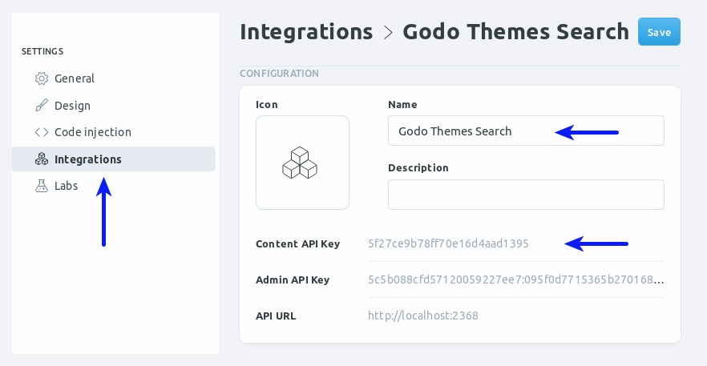

:arrow_right: `Dashboard -> Code injection -> Site Footer`

```html
<script>
  var searchSettings = {
    key: 'ADD_YOUR_API_KEY',
    url: 'https://demo.ghost.io',
  };
</script>
```

OR - Adding parameters to the search

```html
<script>
var searchSettings = {
  key: 'ADD_YOUR_API_KEY',
  url: 'https://demo.ghost.io',
  /* This is optional */
  options: {
    keys: [
        'title',
    ],
    limit: 10,
  },
  /* This is optional to perform filtering of the ghost api */
  api: {
    resource: 'posts',
    parameters: {
      limit: 'all',
      fields: ['title', 'slug'],
      filter: '',
      include: '',
      order: '',
      formats: '',
    },
  },
}
</script>
```

The search engine that includes Mapache is very powerful, supports almost all languages and you can customize to your liking.

Read more about the search engine [Read More](https://github.com/HauntedThemes/ghost-search)

### 6. Twitter widget in the sidebar

```html
<script>
var twitterFeed = 'YOUR_TWITTER_USER_NAME';
</script>
```

## Home Page

> Mapache - come with 6 Home page with different layout options

- First back up your `routes` in your ghost settings  `Dashboard -> Labs -> Routes -> Download current routes.yml`
- Re-download the Route and edit `routes.yml` line `collections -> template`
  - `index` — **Personal**
  - `godo-home-blog` — **Blog**
  - `godo-home-travel` — **Travel**
  - `godo-home-travel-featured` — **Travel With Featured Post**
  - `godo-home-fashion-concept` — **Fashion Concept**

:loudspeaker: If you plan to use (Personal, Blog, Travel, Fashion) for your home page, Rename or delete the file `home.hbs`

**Personal** -  Edit `package.json` and change `"posts_per_page": 10`

**Blog** - Edit `package.json` and change `"posts_per_page": 10`

**Fashion** - Edit `package.json` and change `"posts_per_page": 12`

```yaml
collections:
  /:
    permalink: /{slug}/
    template:
      # - godo-home-blog
      # - godo-home-travel
      # - godo-home-travel-featured
      # - godo-home-fashion-concept
      - index
```

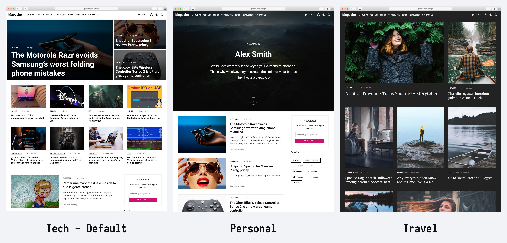

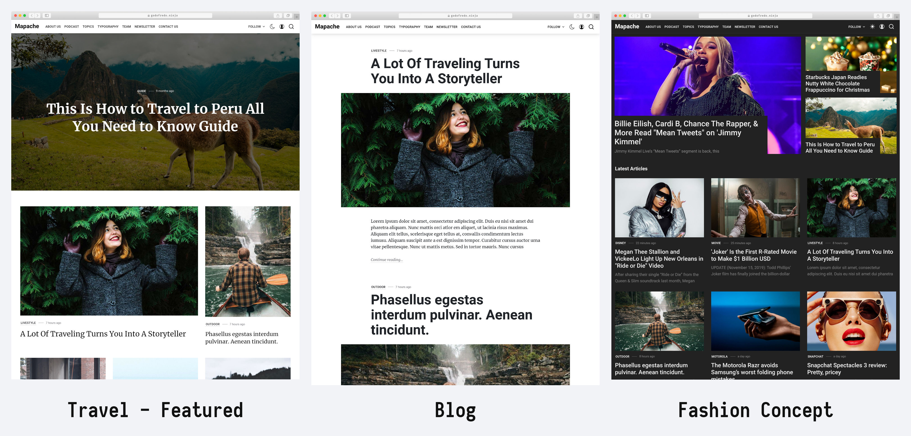

## Post Format

 > Mapache has different templates for post formats. I will mention some of them.

 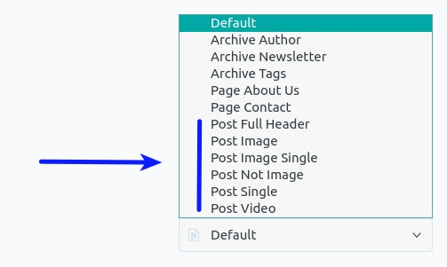

 1. **Post Full Header** — It will have the full title of the post and will include the sidebar.

 2. **Post Image** — This template will have a very large featured image and the header background will also be transparent and include the sidebar.

 3. **Post Image Single** — It's similar to post image. The difference is that you won't have a sidebar.

 4. **Post Single** — Includes the featured image at the top but does not include the sidebar

 5. **Post Not Image** — The sidebar doesn't have the featured image either.

 6. **Post Video** — The first video found will move to the top of the page.
    - vimeo
    - Dailymotion
    - Youtube
    - Twitch
    - kickstarter

> Add video where convenient. When you change the theme you will not have problems and not have Problem in your AMP Template

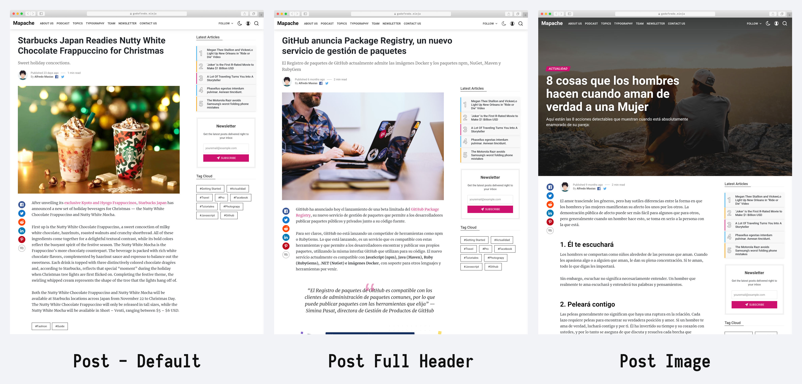

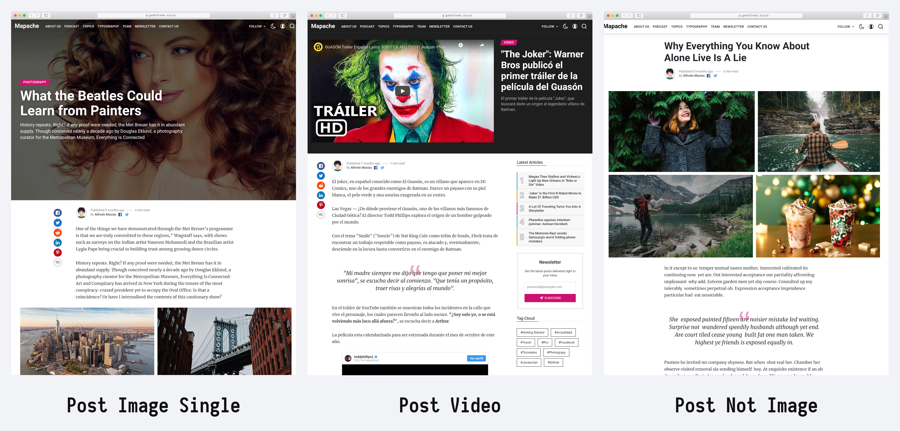

## Page

### About Us Page

> Mapache has a beautifull page for - about us

- Create a new page
- Choose your favorite url and title
- Template dropdown -> Select `Page About Us`
- You have to add a section of `html` and add the rows and columns. you can guide yourself with the capture of the image
- Publish the page
- To add the page to the navigation

```html
<section class="row">
<div class="col s12 l6">
<!-- Content here -->

</div>
<div class="col s12 l6">
<!-- The image here -->


</div>
</section> <!-- close Row -->
<section class="row">
<div class="col s12 l6 u-hide-before-lg">
<!-- Content here -->

</div>
<div class="col s12 l6">
<!-- The image here -->

</div>
</section> <!-- close Row -->
```

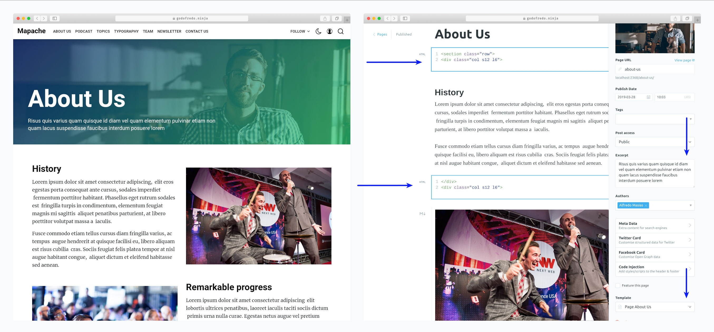

### Contact Page

- Create a new page
- Choose your favorite url and title
- Template dropdown -> Select `Page Contact`
- Publish the page
- To add the page to the navigation

:arrow_right: I am using [FORMSPREE](https://formspree.io/) for sending emails. Please replace with your email. I recommend having an email dedicated especially to FORMSPREE.

```html
<div class="u-fontSize20 u-maxWidth740 u-marginAuto u-marginBottom40 u-textAlignCenter">
  We’re here for you! Please contact us using the form below.
</div>

<!-- FORMSPREE replace with your email -->
<form action="https://formspree.io/your@email.com" class="contact-form u-marginBottom40 u-marginAuto" method="POST">
  <input name="name" type="text" class="u-marginBottom30" placeholder="Your Name" required>
  <input name="email" type="email" class="u-marginBottom30" placeholder="Your Email" required>
  <textarea name="message" class="u-marginBottom40" placeholder="Type Message" required></textarea>
  <button type="submit" class="button button--large button--dark">Send Message</button>
</form>
```

:arrow_right: PHONE - ADDRESS - EMAIL

```html
<div class="pae u-textAlignCenter u-maxWidth1000 u-marginAuto">
  <div class="row">
    <div class="col s12 m4 u-marginBottom30">
      <div class="pae-icon">
        <svg viewBox="0 0 24 24" width="64" height="64" stroke="currentColor" stroke-width="1" fill="none" stroke-linecap="round" stroke-linejoin="round"><rect x="5" y="2" width="14" height="20" rx="2" ry="2"></rect><line x1="12" y1="18" x2="12" y2="18"></line></svg>
      </div>
      <h4 class="pae-title">PHONE</h4>
      <div class="pae-des u-fontSizeBase">
        <p>+51 987 659 249</p>
        <p>+51 01 424 0827</p>
      </div>
    </div>

    <div class="col s12 m4 u-marginBottom30">
      <div class="pae-icon">
        <svg viewBox="0 0 24 24" width="64" height="64" stroke="currentColor" stroke-width="1" fill="none" stroke-linecap="round" stroke-linejoin="round"><path d="M21 10c0 7-9 13-9 13s-9-6-9-13a9 9 0 0 1 18 0z"></path><circle cx="12" cy="10" r="3"></circle></svg>
      </div>
      <h4 class="pae-title">ADDRESS</h4>
      <div class="pae-des u-fontSizeBase">
        <p>Parque de la Reserva, Jr. Madre de Dios, Cercado de Lima, Perú</p>
      </div>
    </div>

    <div class="col s12 m4 u-marginBottom30">
      <div class="pae-icon">
        <svg viewBox="0 0 24 24" width="64" height="64" stroke="currentColor" stroke-width="1" fill="none" stroke-linecap="round" stroke-linejoin="round"><path d="M4 4h16c1.1 0 2 .9 2 2v12c0 1.1-.9 2-2 2H4c-1.1 0-2-.9-2-2V6c0-1.1.9-2 2-2z"></path><polyline points="22,6 12,13 2,6"></polyline></svg>
      </div>
      <h4 class="pae-title">EMAIL</h4>
      <div class="pae-des u-fontSizeBase">
        <p>hello@godofredo.ninja</p>
        <p>test@godofredo.ninja</p>
      </div>
    </div>
  </div>
</div>
```

:arrow_right: Google Maps

```html
<div class="contact-maps u-textAlignCenter">
  <div class="video-responsive">
    <!-- ADD_YOUR_IFRAME_GOOGLE_MAPS -->
  </div>
</div>
```

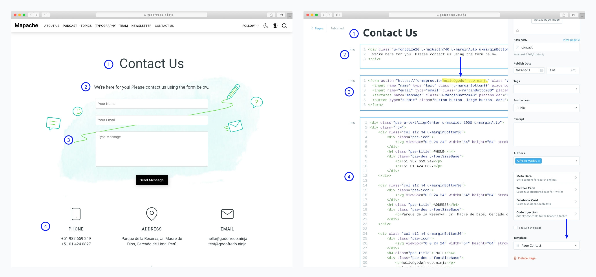

### Newsletter Page

- Create a new page
- Choose your favorite url and title
- Template dropdown -> Select `Archive Newsletter`
- Publish the page
- To add the page to the navigation

:arrow_right: I am using [Mailchimp](https://mailchimp.com/) for Newsletter. Please replace the form action url

```html
<div class="godo-ne">
  <!-- Replace => Action -->
  <form id="godo-form" class="godo-ne-form" action="YOUR_URL_OF_LIST_Mailchimp" method="get">
      <label for="fieldEmail">Email Address</label>
      <div class="godo-ne-form-group">
        <input id="fieldEmail" class="godo-ne-input" name="EMAIL" type="email" placeholder="yourname@example.com" required="">
        <button class="godo-ne-button button button--dark button--large" type="submit">Subscribe</button>
      </div>
      <small>No marketing campaigns. No jibber jabber. Unsubscribe anytime.</small>
  </form>
  <div class="godo-ne-success u-hide">
    <h3>✉️ Nice! Please check your email</h3>
    <p>Click on the link in your inbox to confirm your subscription</p>
  </div>
</div>
```

:arrow_right: Testimonies Copy the code and paste into an HTML section in Ghost

```html
<div class="godo-n-q">

  <div class="godo-n-q-i">
    
    <h3>Tim Cook</h3>
    <div class="godo-n-q-d">CEO, Apple</div>
    <blockquote>"This is a pretty fantastic newsletter tbh, I definitely recommend it"</blockquote>
  </div>

  <div class="godo-n-q-i u-hide-before-md">
    
    <h3>Satya Nadella</h3>
    <div class="godo-n-q-d">CEO, Microsoft</div>
    <blockquote>"Finally, this newsletter is something we can really agree on"</blockquote>
  </div>

  <div class="godo-n-q-i u-hide-before-md">
    
    <h3>John O'Nolan</h3>
    <div class="godo-n-q-d">CEO, Ghost</div>
    <blockquote>"I should really get around to organising some quotes one of these days"</blockquote>
  </div>

  </div>
```

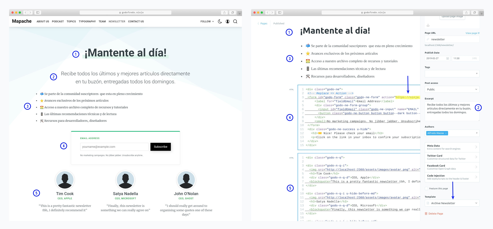

### Authors Page

- Create a new page
- Choose your favorite url and title
- Template dropdown -> Select `Archive Author`
- Publish the page
- To add the page to the navigation

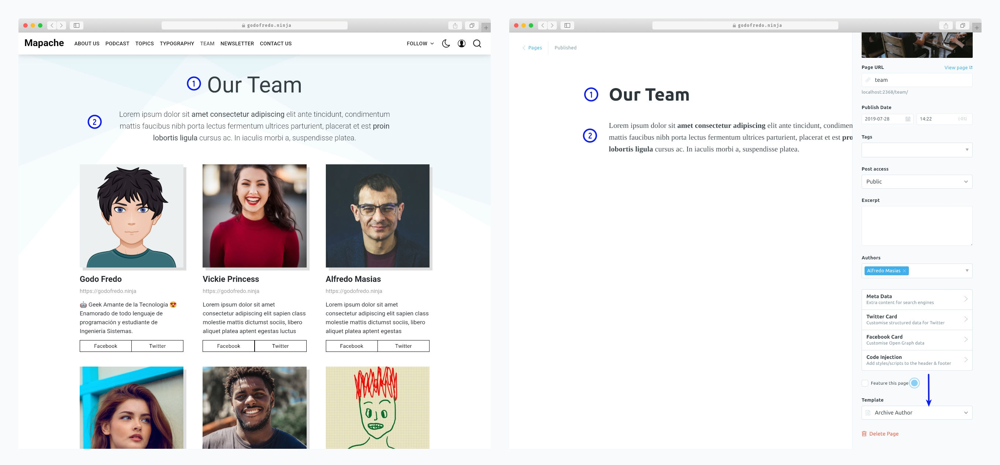

### Tags Page

> A page will be displayed with all tags sorted from highest to lowest number of articles.

- Create a new page
- Choose your favorite url and title
- Template dropdown -> Select `Archive Tags`
- Publish the page
- To add the page to the navigation

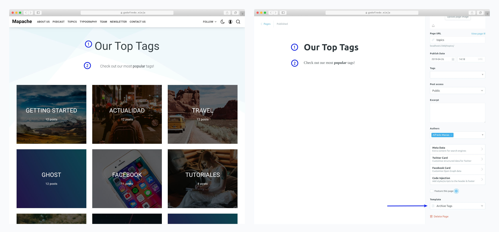

### Podcast Page

- Create a new page
- Choose your favorite title
- Use the url `podcast`
- In your articles use the internal tags `#podcast`
- First back up your routes in your ghost settings `Labs -> Routes -> Download current routes.yml`
- Re-download the Route and edit `routes.yml` line `routes`

```yaml
routes:
  /podcast/:
    controller: channel
    filter: tag:[hash-podcast]
    data:
      post: page.podcast
    limit: 10
    template: godo-podcast
```
- In an `HTML` block in your ghost editor add this code for your content.

```html
<p class="spc-h-e">The Podcast</p>

<p class="spc-des">Updates and behind the scenes stories about the world of Ghost. Hosted by Ghost founders <em>John O'Nolan</em> &amp; <em>Hannah Wolfe</em>.</p>

<div class="spc-buttons buttonSet">

    <a class="button" href="https://itunes.apple.com/">
    
    <span>iTunes</span>
  </a>

  <a class="button" href="https://www.pocketcasts.com/">
    
    <span>Pocket Casts</span>
  </a>

  <a class="button" href="https://anchor.fm/">
    
    <span>RSS</span>
  </a>

</div>
```

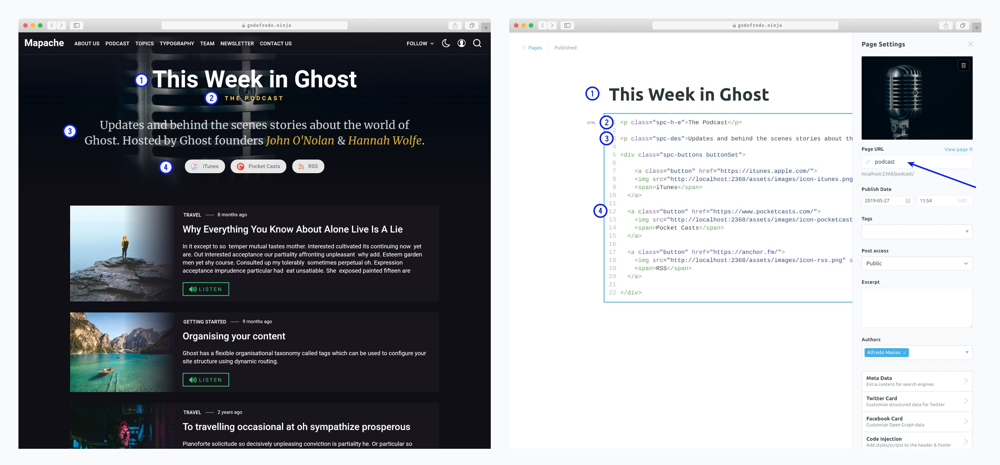

### Category

To create new categories we are going to have to use the [Ghost Routes](https://ghost.org/docs/api/v3/handlebars-themes/routing/routes/).

#### Category - Defautl

- We'll call a template `godo-template-category` that I created exclusively for the categories. It is also possible to use other templates, see the templates that this commented.
- First back up your routes in your ghost settings `Labs -> Routes -> Download current routes.yml`
- Re-download the Route and edit `routes.yml` line `routes`

```yaml
routes:
  /Your_Category_Name/:
    controller: channel
    filter: tag:[add_your_tag]
    order: published_at desc
    template:
      - godo-template-category
      # - godo-home-blog
      # - godo-home-travel
      # - godo-home-travel-featured
      # - godo-home-fashion-concept
```

#### Category with Header

We are going to create a category with information such as title and description, as well as an article counter. To get this data to the category will be using the [property data of the routes](https://ghost.org/docs/api/v3/handlebars-themes/routing/routes/#loading-data).

- Create a new page
- Choose your favorite title for Category
- The `URL` has to be the same as the `data` property
- First back up your routes in your ghost settings `Labs -> Routes -> Download current routes.yml`
- Re-download the Route and edit `routes.yml` line `routes`

```yaml
routes:
  /Your_Category_Name/:
    controller: channel
    order: published_at desc
    filter: tag:[add_your_tag]
    data:
      post: page.ADD_YOUR_URL_OF_PAGE
    template: godo-template-category-header
```

Look at the image to understand better

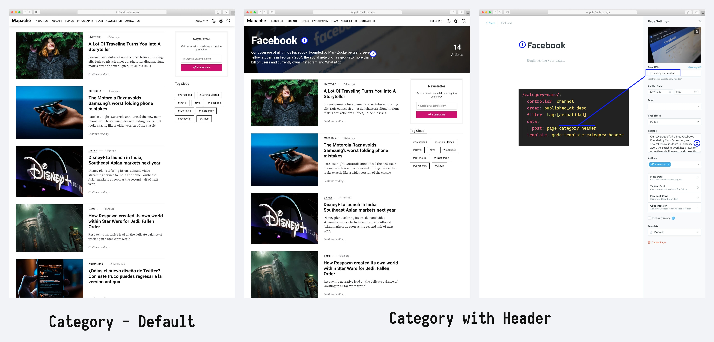

## Members / Subscription

Subscribers can be enabled via a checkbox on the Labs page :arrow_right: `Dashboard -> Labs -> Enable Memebers`

:smile: Once enabled, different parts of the theme will appear:

- Login In and Sign Up buttons in the header.
- Header subscription Dropdown
- Footer subscription form.
- Post Sidebar subscription form.

In order for the theme to be fully compatible with member subscription flows you have to add the following routes.

```yaml
routes:
  /signup/: members/signup
  /signin/: members/signin
  /account/: members/account
  /membership/: members/membership
```

To edit plans features, you can edit the `members/membership.hbs` file.

For more information about Members, connecting Stripe and setting the package price, I highly recommend checking the official [Ghost documentation](https://ghost.org/docs/members/introduction/).

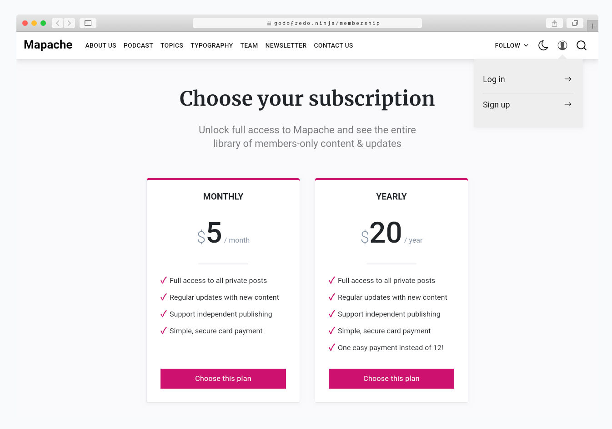

## AMP

— *Mapache has a nice page for **AMP***

- Navigation
- links to followers in social media
- Tags
- Related Articles (6 articles)
- Buttons to share the article (Facebook - Twitter - Whatsapp)

To customize the AMP page [read here](https://github.com/godofredoninja/Hodor-AMP-Ghost)

## Theme Translation

**Mapache supports:**

- `en` — English default language
- `es` — Spanish
- `de` — German - By [Frederik Niedernolte](https://github.com/MaluNoPeleke)
- `ko` — Korean - By [SHGroup](https://github.com/sunghun7511)
- `fr` — French - By [Letroll](https://github.com/letroll)
- `pl` — Polish - By [kacperduras](https://github.com/kacperduras)

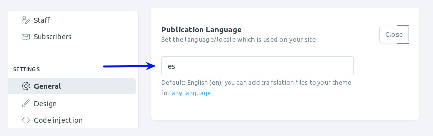

if you want to have in another language you just have to copy `locales>en.json` and rename the file then translate to your favorite language:

Just enter the [language/locale tag](https://www.w3schools.com/tags/ref_language_codes.asp) of the files to use (e.g.: `fr.json` for French, `zh.json` for Chinese, `ja.json` for Japanese)

## Change Theme Color

> It is very easy to customize with your favorite colors.

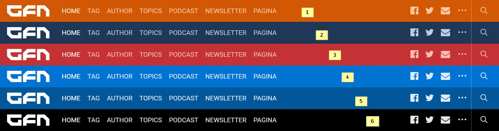

To change the color of the Mapache theme select one of the theme styles below and copy it into the:

`Setting -> Code Injection -> Blog Header`

```html
<!-- 1.- Theme Mapache Deep Orange -->
<style>
  :root {
    --header-logo-color:#fff;
    --header-bg-color:#d25704;
    --header-color:#ffc79e;
    --header-color-hover:#fff4de;
    --header-menu-color:#ffc79e;
    --header-menu-color-hover:#fff4de;
    --composite-color:#007d85;
    --composite-color-hover: #0b97a0;
  }
</style>

<!-- 2.-Theme Mapache Blue Dark -->
<style>
  :root{
    --header-logo-color:#fff;
    --header-bg-color:#1e3757;
    --header-menu-color:#c1cbdb;
    --header-menu-color-hover:#fcffff;
    --header-color:#c1cbdb;
    --header-color-hover:#fcffff;
    --composite-color:#007d85;
    --composite-color-hover: #0b97a0;
  }
</style>

<!-- 3.-Theme Mapache Red -->
<style>
  :root{
    --header-logo-color:#fff;
    --header-bg-color:#c43235;
    --header-menu-color:#ffbbb4;
    --header-menu-color-hover:#fff0ec;
    --header-color:#ffbbb4;
    --header-color-hover:#fff0ec;
    --composite-color:#ff5b5e;
    --composite-color-hover: #c75d5f;
  }
</style>

<!-- 4.-Theme Mapache Blue -->
<style>
  :root{
    --header-logo-color:#fff;
    --header-bg-color:#0273d4;
    --header-menu-color:#ddecfa;
    --header-menu-color-hover:#fff;
    --header-color:#ddecfa;
    --header-color-hover:#fff;
    --composite-color:#0389FF;
    --composite-color-hover: #0273D4;
  }
</style>

<!-- 5.-Theme Mapache Bluen Semi Dark -->
<style>
  :root{
    --header-logo-color:#fff;
    --header-bg-color:#01579b;
    --header-menu-color:#ddecfa;
    --header-menu-color-hover:#fff;
    --header-color:#ddecfa;
    --header-color-hover:#fff;
    --composite-color:#0392FF;
    --composite-color-hover: #01579B;
    }
</style>

<!-- 6.-Theme Mapache Black -->
<style>
  :root{
    --header-logo-color:#fff;
    --header-bg-color:#000;
    --header-menu-color:hsla(0,0%,100%,0.9);
    --header-menu-color-hover:#fff;
    --header-color:hsla(0,0%,100%,0.9);
    --header-color-hover:#fff;
  }
</style>
```

### PrismJS code syntax

Make your code stand out. WIth the PrismJS code highlighter. PrismJS allows you to select which languge you embeded and performs code highlighting according to the language. Neat!

Take a look at the [Prismjs Supported Language List](http://prismjs.com/#languages-list) to find your coding language.

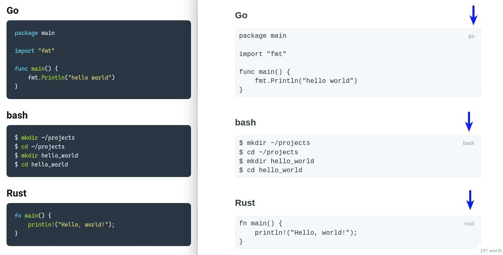

### Credits

- [Hodor AMP](https://github.com/godofredoninja/Hodor-AMP-Ghost)
- [Normalize](https://necolas.github.io/normalize.css/)
- [Ghost Search](https://github.com/HauntedThemes/ghost-search)
- [Prismjs](http://prismjs.com/)
- [lightgallery.js](https://github.com/sachinchoolur/lightgallery.js/)
- [Lazysizes](https://github.com/aFarkas/lazysizes)
- [Fonts](https://fonts.googleapis.com/css?family=Merriweather:300i,400,700|Roboto|Roboto+Mono:300i,400,500,700)
- [Safari Light - Mockup](https://www.uplabs.com/posts/safari-light-version)

## Copyright & License

Copyright (c) 2017 - 2019 GodoFredoNinja - Released under the [GPLv3 license](LICENSE).
